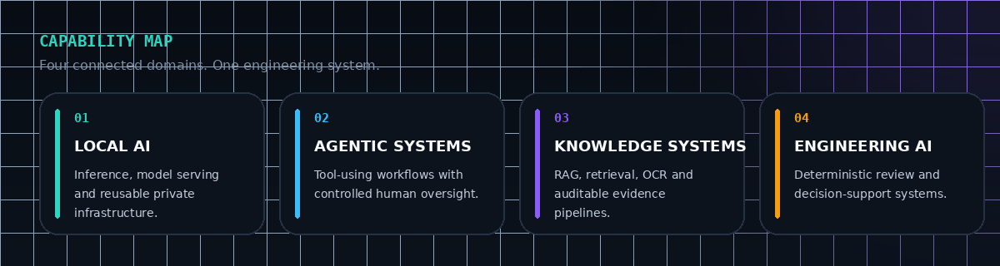
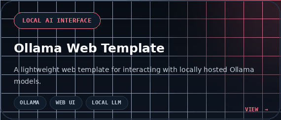
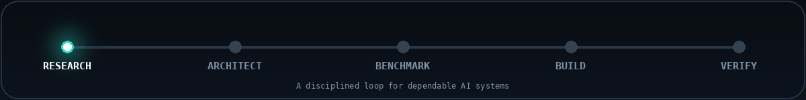

  

  
  
  
  

  <strong>
    Designing private AI platforms and turning complex technical ideas
    into dependable, maintainable systems.
  </strong>

 

## Building now

  
  
  
  

AI Station is my current flagship open-source project: a reproducible,
local-first AI workstation for private inference, reusable local APIs,
retrieval, search, OCR, document processing and speech recognition.

 

## Capability map

  

## Selected systems

  
  

  
  

 

## Technical stack

  
  
  
  
  
  
  
  
  
  
  
  
  
  
  
  
  
  
  
  
  
  
  
  
  
  
  
  
  
  
  
  
  
  
  
  
  
  
  
  
  

The stack reflects the tools and technical domains I use across local AI,
machine learning, backend systems, retrieval, observability and dependable
infrastructure.

 

## Engineering loop

  

My engineering approach is straightforward:

- architecture before accumulation;
- benchmarks before migration;
- privacy and reproducibility by default;
- explicit validation and rollback before release.

## Background

My work combines AI engineering, software architecture, technical operations
and product development.

My earlier background in structural engineering still shapes how I build
software: assumptions should be explicit, acceptance criteria measurable,
decisions traceable and critical systems predictable under failure.

## Collaboration

I am open to technically serious collaboration involving:

- local and on-premise AI infrastructure;
- agentic development systems;
- RAG and document intelligence;
- computer vision and multimodal applications;
- engineering-focused AI products;
- reproducible AI deployment and MLOps.

  

  
    Private by design · Evidence-driven by practice · Built for long-term use
  

