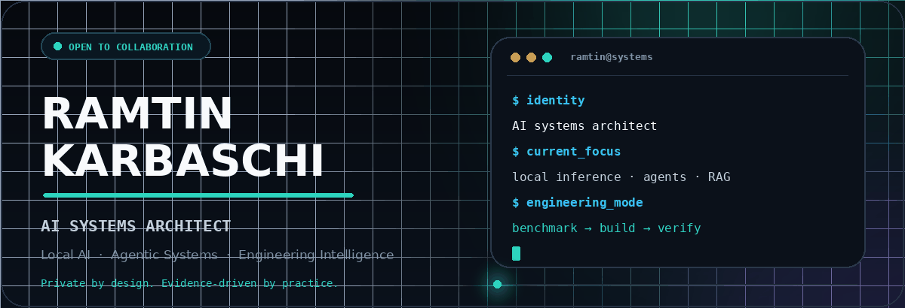
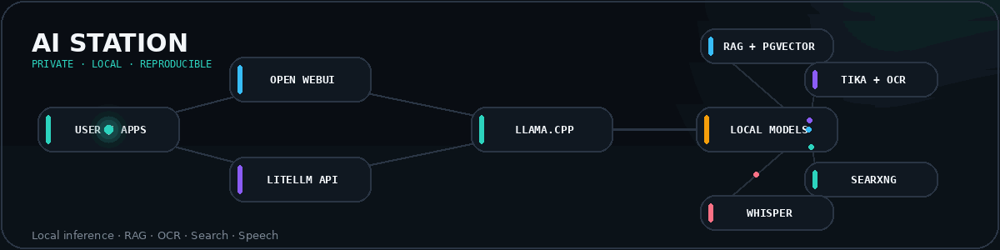

 

  

<strong>Building private, reproducible and operationally reliable AI systems.</strong>

---

## About

<table>
<tr>
<td width="58%" valign="top">

I design and build **local-first AI platforms, intelligent products and dependable automation systems**.

My work spans local LLM inference, model serving, retrieval-augmented generation, agentic workflows, computer vision, document intelligence, backend infrastructure and technical product development.

I focus on the engineering around AI—not only the model itself: architecture, privacy, reproducibility, resource control, observability, validation, rollback and long-term maintainability.

</td>
<td width="42%" valign="top">

### Current focus

- Adaptive local inference
- Multi-project AI platforms
- Agentic IDE workflows
- Hybrid retrieval and reranking
- Document and engineering intelligence
- Auditable decision-support systems

</td>
</tr>
</table>

---

## Featured project

 

**AI Station** is a reproducible local-first AI workstation for Windows 11, WSL2, Docker and NVIDIA GPUs. It provides private inference, OpenAI-compatible local APIs, RAG, search, OCR, document processing, embeddings and speech recognition—while emphasizing deterministic installation, integrity verification, operational audits, backup and recovery.

---

## Selected work

<table>
<tr>
<td width="50%" valign="top">

### [ContentFusion-LLM](https://github.com/Ramtin-Karbaschi/ContentFusion-LLM)

Integrated AI analysis across text, image, audio and video workflows.

[Open repository →](https://github.com/Ramtin-Karbaschi/ContentFusion-LLM)

</td>
<td width="50%" valign="top">

### [ANPR + Sentiment Analysis](https://github.com/Ramtin-Karbaschi/PlateNumberDetection_and_SentimentAnalysis)

Computer vision and NLP pipeline combining automatic number-plate recognition with multi-stage sentiment analysis.

[Open repository →](https://github.com/Ramtin-Karbaschi/PlateNumberDetection_and_SentimentAnalysis)

</td>
</tr>
<tr>
<td width="50%" valign="top">

### [Behavior + Market Analysis](https://github.com/Ramtin-Karbaschi/BehaviorDetection_and_MobileMarketAnalysis)

Behavioral pattern analysis and mobile-market segmentation using statistical and unsupervised methods.

[Open repository →](https://github.com/Ramtin-Karbaschi/BehaviorDetection_and_MobileMarketAnalysis)

</td>
<td width="50%" valign="top">

### [Ollama Web Template](https://github.com/Ramtin-Karbaschi/Ollama_Web_Template)

Modern responsive interface for interacting with locally hosted Ollama language models.

[Open repository →](https://github.com/Ramtin-Karbaschi/Ollama_Web_Template)

</td>
</tr>
</table>

---

## Technical stack

  
  
  
  
  
  
  
  
  
  
  
  
  
  
  
  
  
  
  
  
  
  
  
  
  
  
  
  
  
  
  
  
  
  
  
  
  
  
  
  

---

## Engineering principles

<table>
<tr>
<td width="25%" align="center" valign="top">

<strong>Local-first</strong>

Sensitive workloads remain under local control.

</td>
<td width="25%" align="center" valign="top">

<strong>Benchmark-driven</strong>

Technology choices follow measured evidence.

</td>
<td width="25%" align="center" valign="top">

<strong>Reproducible</strong>

Models, images and configuration are controlled.

</td>
<td width="25%" align="center" valign="top">

<strong>Auditable</strong>

Decisions, failures and recovery remain traceable.

</td>
</tr>
</table>

---

## Background

My work combines **AI engineering, software architecture, technical operations and product development**.

My earlier background in structural engineering still shapes how I build software: assumptions should be explicit, acceptance criteria measurable, decisions traceable and critical systems predictable under failure.

---

## Collaboration

I am open to technically serious collaboration involving local AI infrastructure, agentic systems, RAG, document intelligence, computer vision, engineering-focused AI and reproducible deployment.

  

Private by design · Evidence-driven by practice · Built for long-term use

