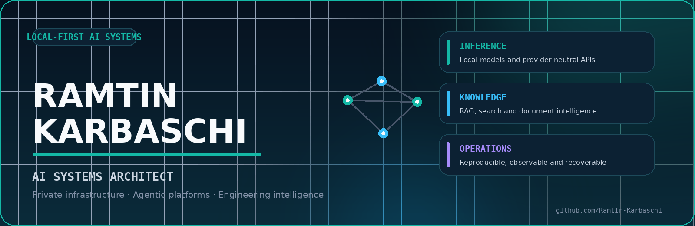
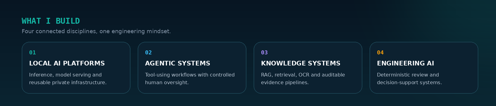
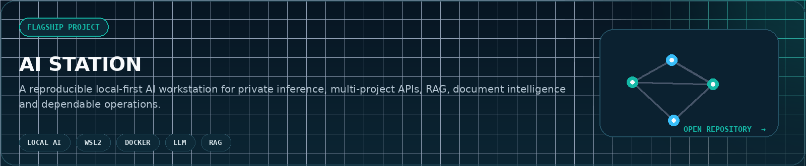
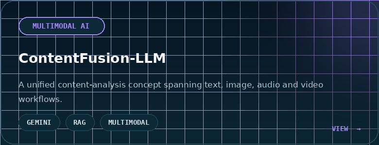
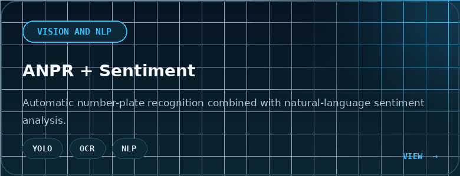
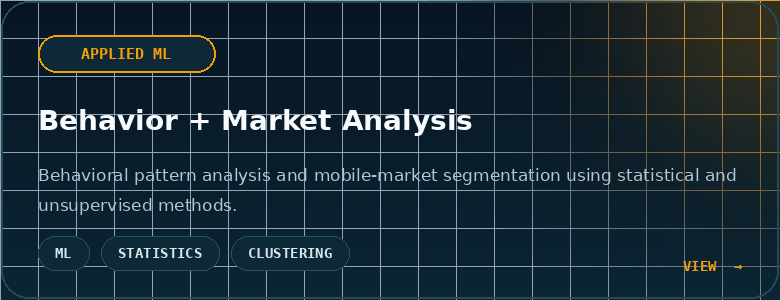
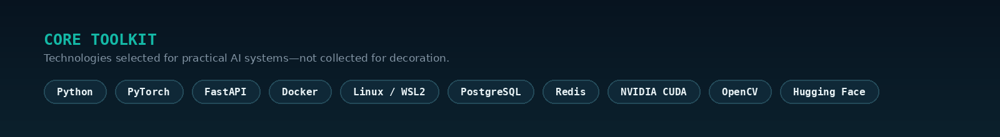

  <picture>
    <source
      media="(prefers-color-scheme: dark)"
      srcset="assets/hero-dark.png"
    >
    <source
      media="(prefers-color-scheme: light)"
      srcset="assets/hero-light.png"
    >
    
  </picture>

  <a href="mailto:ramtin.karbaschi@gmail.com">Email</a>
  &nbsp;·&nbsp;
  <a href="https://www.linkedin.com/in/ramtinkarbaschi/">LinkedIn</a>
  &nbsp;·&nbsp;
  <a href="https://github.com/Ramtin-Karbaschi/ai-station">AI Station</a>
  &nbsp;·&nbsp;
  <a href="https://t.me/RamtinKarbaschi">Telegram</a>
  &nbsp;·&nbsp;
  <a href="https://x.com/RamtinKarbaschi">X</a>

  <strong>
    I design private AI platforms and turn complex technical ideas
    into reliable, maintainable systems.
  </strong>

 

## Profile

I work across **AI systems architecture, local inference, agentic workflows,
document intelligence and technical product development**.

My focus is not simply making models run. I build the surrounding engineering
required for long-term use: clear architecture, reproducible deployment,
resource control, observability, rollback and evidence-based technical
decisions.

  <picture>
    <source
      media="(prefers-color-scheme: dark)"
      srcset="assets/focus-dark.png"
    >
    <source
      media="(prefers-color-scheme: light)"
      srcset="assets/focus-light.png"
    >
    
  </picture>

## Featured work

 

  
  

  

## Engineering approach

| Principle | Practical meaning |
|---|---|
| **Local-first** | Sensitive workloads and organizational knowledge remain under local control. |
| **Benchmark-driven** | Technology is selected by measured performance and reliability—not hype. |
| **Reproducible** | Images, models, configuration and installation paths are explicitly controlled. |
| **Auditable** | Important decisions, checks, failures and recovery paths remain traceable. |

  <picture>
    <source
      media="(prefers-color-scheme: dark)"
      srcset="assets/toolkit-dark.png"
    >
    <source
      media="(prefers-color-scheme: light)"
      srcset="assets/toolkit-light.png"
    >
    
  </picture>

## Background

My work combines **AI engineering, software architecture, product development
and technical operations**.

My earlier background in structural engineering continues to influence how I
approach software: assumptions should be explicit, decisions should be
traceable, acceptance criteria should be measurable and critical systems
should fail predictably.

## Current direction

- Adaptive local inference architectures
- Multi-project AI platforms
- Agentic IDE and coding workflows
- RAG, hybrid retrieval and reranking
- Document and engineering intelligence
- Reliable local automation
- Auditable AI decision-support systems

## Collaboration

I am open to technically serious collaboration involving local AI
infrastructure, intelligent products, RAG, document understanding, computer
vision, agentic systems and engineering-focused AI.

  <a href="mailto:ramtin.karbaschi@gmail.com">
    <strong>ramtin.karbaschi@gmail.com</strong>
  </a>

  Private by design · Evidence-driven by practice · Built for long-term use

