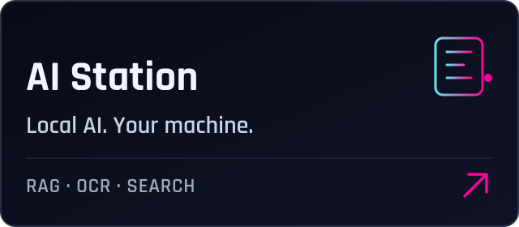
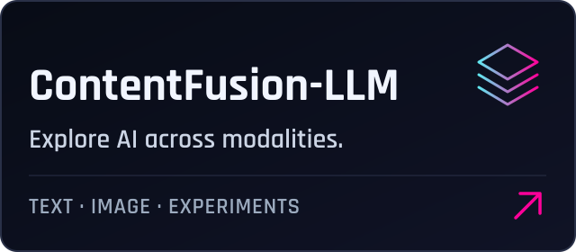
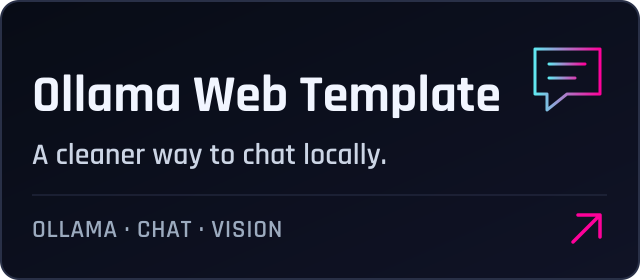

<!-- Header -->

<!-- Icon catalog: https://icon-sets.iconify.design/ -->
<h3>CONTACT ME

</h3>

<table>
<tr>
<td width="50%" rowspan="2" valign="top">

<!-- AI Station -->

  

<!-- ContentFusion -->

  

<!-- Ollama -->

  

</td>
<td width="50%" valign="top">

     
  
  
  
  
  
  
  
  
  
  
  
  
  
  
  
  
  
  
  
  
  
  
  
  
  
  
  
  
  <!--
  
  
  
  
  
  
  
  
  
  
  
  
   -->

</td>
</tr>
<tr>
<td width="50%" valign="top">
<h2>FOCUS FIELDS</h2>
<ul>
  <li>Local AI &amp; LLMs</li>
  <li>RAG &amp; document intelligence</li>
  <li>Computer vision &amp; multimodal AI</li>
  <li>Agentic workflows &amp; automation</li>
  <li>Data analysis &amp; AI architecture</li>
</ul>
</td>
</tr>
</table>
